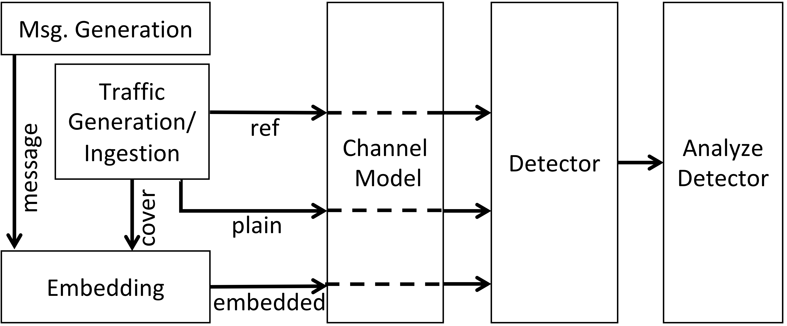

# The NExtSteP (NRL Extensible Stealthy Protocol) Testbed version 0.1

## Overview

The NExtSteP (NRL Extensible Stealthy Protocol) Testbed enables the experimental analysis of the detectability of potentially stealthy communications.  The testbed ("NExtSteP" for short) is extensible in that it allows various types of innocuous cover traffic, various methods of embedding communication into that traffic, various methods to attempt to detect embedded communication, and various metrics for evaluating the performance of these detectors.

The output of a NExtSteP experiment is an evaluation of a detector against an embedding method (in a particular traffic setting).  The process for getting to that point is illustrated in the following figure.

In particular, NExtSteP produces a message, modeled as a random bit sequence (to mimic an encrypted message).  It also produces three types of traffic samples: "reference", "cover", and "plain".  These can be generated synthetically by NExtSteP, or they can be ingested by NExtSteP from external captures.  NExtSteP then embeds some part of the message into the cover traffic, using a specified embedding method, to produce "embedded" traffic.  The reference, plain, and embedded traffic is passed through a channel model; this may leave it unmodified, add synthetic noise (a future step), or add noise via emulation of a network (currently envisioned to be done using CORE).  The traffic is then provided to a detector, which must distinguish plain from embedded traffic; typically, detectors make use of reference traffic to do this.  Finally, the results of the detector (over many different examples of plain and embedded traffic, and potentially with respect to multiple examples of reference traffic) are evaluated using various metrics.

## Installation

### Directory structure

If the NExtSteP repository (which we will call the "nextstep directory") is `nextstep/`, create the following directories manually in the same directory as `nextstep/`:

    data/
    data/logs/
    data/sqrtdata/

### Software requirements

#### General

This version of NExtSteP has been developed primarily under Python 3.7.1.

The packages used are described in the pip requirements file `nextstep/requirements.txt`.

#### PRNGs

NExtSteP allows the use of various PRNGs.  The configuration file `nextstep/nextstep.cfg` in this release uses ChaCha20 from the PyCryptodome package (included in the pip requirements file).  The code may also assume the presence of the following PRNGs (these should be installed manually or references to them may need to be removed from the NExtSteP code):

PCG (minimal C implementation, version 0.9), available from http://www.pcg-random.org/  The distributed `pcg-c-basic-0.9/` directory should be placed in `nextstep/libStealthy/pRandom/`

SFMT (v. 1.5.1), available from http://www.math.sci.hiroshima-u.ac.jp/~m-mat/MT/SFMT/index.html  The distributed `SFMT-src-1.5.1/` directory should be placed in `nextstep/libStealthy/pRandom/`

NExtSteP includes a slightly restructured version of the public-domain xoshiro256 code (original available from http://prng.di.unimi.it/).

### Build script

After doing the setup described above, run

    python buildExt.py

in the `nextstep/` directory to complete the installation.

## Using NExtSteP

### Configuration of options

NExtSteP scripts can be largely controlled through the command line as illustrated in the sample shell scripts discussed below.  Options that are not given on the command line are typically controlled by a configuration file whose location may be specified on the command line.  A default version of that file is at `nextstep/nextstep.cfg`.  Options specified on the command line take precedence over those specified int the configuration file; within the configuration file, options specified in a script-specific section take precendence over those specified in the `[general]` section.  A handful of parameters (including the location of the configuration file) have default values that are used if they are unspecified on the command line.

### Message generation

The script `nextstep/tools/generate-msgs.py` produces a file with random bits for use as a message to embed.  (The randomness mimics an encrypted message.)  This produces a file `nextstep/urand-b<N>.txt` containing `<N>` random bits using Python's `os.urandom` function.  The default is to produce 4,000,000 bits; for other sizes, the code needs to be edited to change the argument to the `genRandom` function.

The included data file `nextstep/urand-b4000000.txt` can be used instead of running this script.

### Sequence (reference/plain/cover) generation

The script `nextstep/synthetic/generate-data.py` is used to generate synthetic IPD sequences drawn from a specified distribution.  Running it with the `--refs` flag produces reference sequences; running it without this flag produces both plain and cover sequences.  All sequences are drawn from the same distribution, but the file names and locations differ.

Options include (but are not limited to) the distribution from which IPD values should be chosen and the number of sequences to produce.  See the script help (invoked by `python generate-data.py --help`) for further information.

Alternatvely to synthetic generation, the script `nextstep/ingest/ingest-data.py` is used to produce reference, plain, and cover IPD sequences from ingested data.  The data to ingest can be given as an argument to the script.  It should be a JSON-encoded list of IPD values.

### Message embedding

The script `nextstep/experiments/embed.py` is used to embed the (some portion of the) generated message into the cover sequences in order to produce embedded sequences.  The options for this include (but are not limited to) parameters to indicate which cover sequences to use, the embedding method to use, and various embedding parameters.  See the script help (invoked by `python embed.py --help`) for further information.

### Classification

The script `nextstep/experiments/classify.py` is used to run detectors.  The output of a classifier is a sequence of tuples; each tuple contains statistics about an individual plain or embedded sequence and an indication of whether the sequence contained an embedded message.  For detectors that make use of a reference sequence, there is one tuple sequence per reference sequence.  Results are stored in `data/sqrtdata/hq/classout/` (results from synthetic data) or `data/sqrtdata/ingest/classout/` (results from ingested data).

The options for this include (but are not limited to) parameters to indicate which plain/embedded sequences to use, the detector to use, and any detector parameters.  See the script help (invoked by `python classify.py --help`) for further information.

### Analysis

The script `nextstep/experiments/analyze.py` is used to evaluate detectors based on the classification output.  It produces a plot of the performance of the detector as a function of the length of the plain/embedded sequences.  These are stored in `data/sqrtdata/hq/analyzeout/` (plots for synthetic data) or `data/sqrtdata/ingest/analyzeout/` (plots for ingested data).

The options for this include (but are not limited to) options for the type of evaluation (the metric), plotting options, and the data that should be plotted.  See the script help (invoked by `python analyze.py --help`) for further information.

### Sample shell scripts

This repository includes sample shell scripts and data to run NExtSteP.  

The sample shell scripts call the individual Python scripts described above.  The `nextstep/urand-b4000000.txt` file contains 4,000,000 bits output by `generate-msgs.py`, so that Python script is not called by the sample shell scripts.

The `nextstep/synthetic/run-refs-SAMPLE.sh` shell script generates synthetic reference, cover, and plain data.

The `nextstep/experiments/run-exp-SAMPLE.sh` shell script does embedding, classification using detectors, and detector evaluation for synthetic data.  It omits modification using a noisy channel model; this may be thought of as using a noiseless channel.

The `nextstep/ingest/run-ingest-SAMPLE.sh` shell script ingests data (from a location specified near the top of the script) and then runs the embedding, classification, and analysis scripts.  This covers the entire process for ingested data.  As with the synthetic example, this omits the step of modeling a noisy channel.

## Remarks

NExtSteP is experimental and still very much under development.  Anything---file formats/names/locations, algorithms, testbed structure, etc.---may be changed in future releases.

## Licensing

See `nextstep/LICENSE.TXT` for license information.

## Credits

The NExtSteP testbed is designed and written by Olga Chen, Aaron D. Jaggard, Catherine Meadows, and Michael Shlanta (U.S. Naval Research Laboratory).  We thank David Li (MITRE) and Sarah Mousley Mackay (LLNL) for additional contributions they made while at NRL.

The NExtSteP team may be reached via nextstep@nrl.navy.mil
